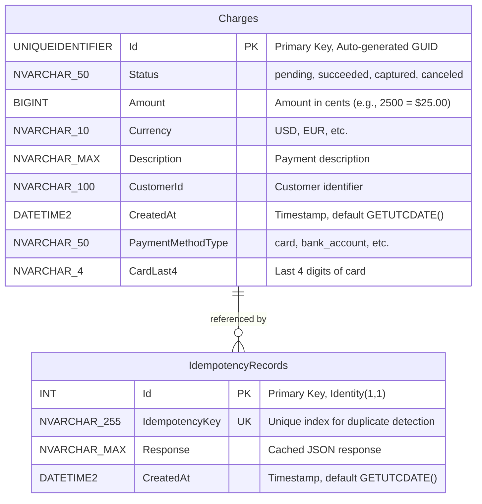
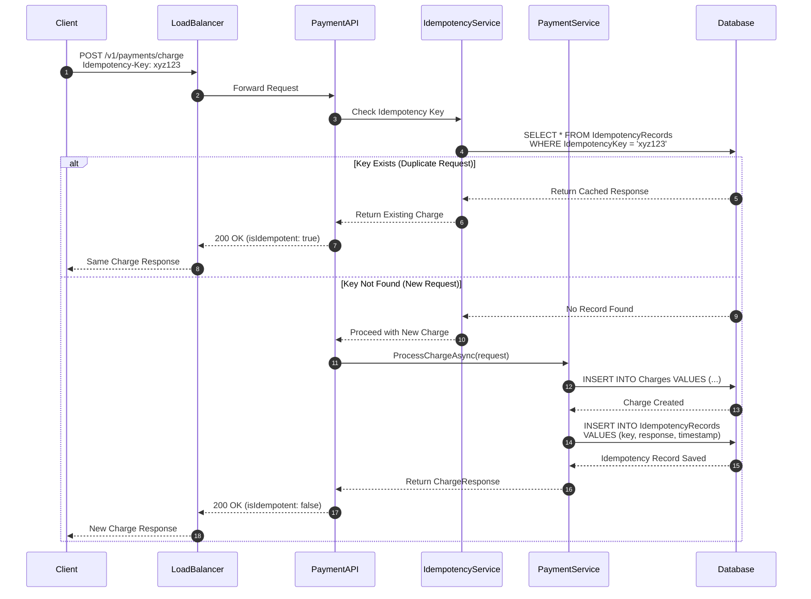
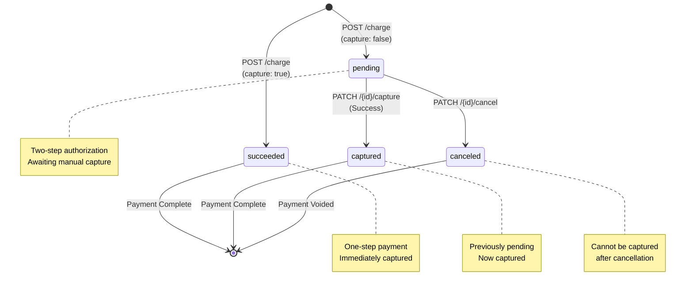
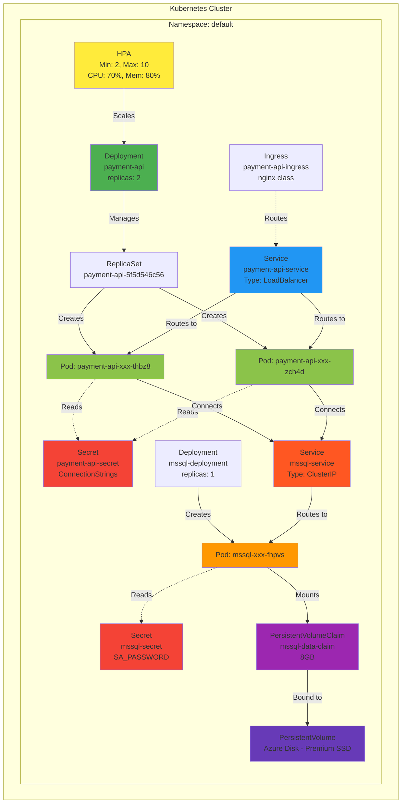
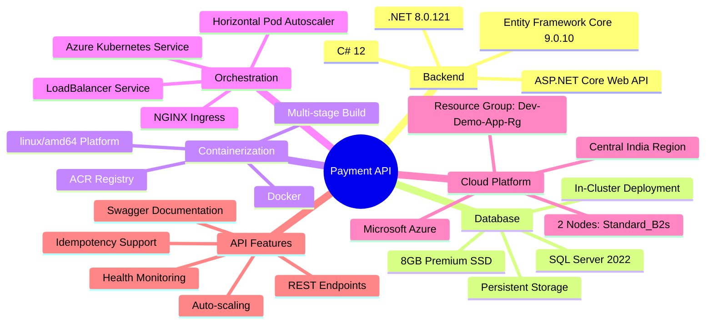
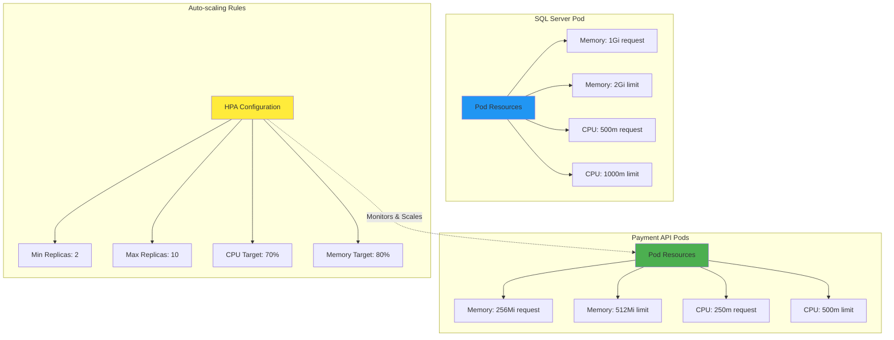
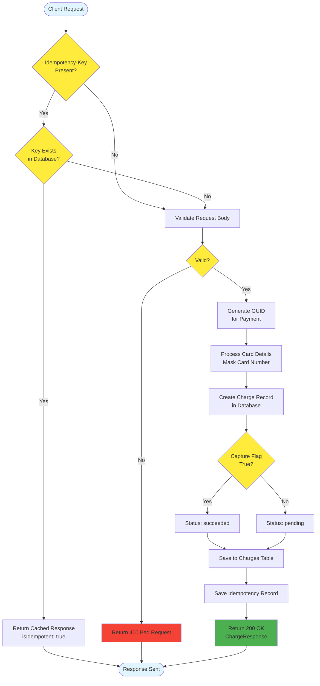

# Payment API - System Architecture & Database Schema

## System Architecture Diagram

```mermaid
graph TB
    subgraph "External Access"
        Client[Client/Browser]
        Internet[Internet]
    end

    subgraph "Azure Load Balancer"
        LB[Azure LoadBalancer<br/>IP: 4.213.208.156]
        DNS[DNS: payment-api.4.187.130.156.nip.io]
    end

    subgraph "Azure Kubernetes Service - payment-aks-cluster"
        subgraph "NGINX Ingress Controller"
            Ingress[Ingress Controller<br/>nginx v1.9.4]
        end

        subgraph "Payment API - Deployment"
            API1[payment-api Pod 1<br/>Image: v1.3]
            API2[payment-api Pod 2<br/>Image: v1.3]
            APIN[payment-api Pod N<br/>Auto-scaled 2-10]
        end

        subgraph "HPA - Auto Scaling"
            HPA[Horizontal Pod Autoscaler<br/>CPU: 70% | Memory: 80%]
        end

        subgraph "SQL Server 2022"
            DB[(SQL Server Pod<br/>mssql-service:1433)]
            PVC[Persistent Volume<br/>8GB Premium SSD]
        end

        subgraph "Kubernetes Services"
            APISvc[payment-api-service<br/>Type: LoadBalancer<br/>Port: 80 → 8080]
            DBSvc[mssql-service<br/>Type: ClusterIP<br/>Port: 1433]
        end
    end

    subgraph "Azure Container Registry"
        ACR[demoimagecontainer.azurecr.io<br/>payment-api:latest, v1.0-v1.3]
    end

    Client -->|HTTP Request| Internet
    Internet -->|http://4.213.208.156| LB
    Internet -->|http://payment-api...nip.io| DNS
    DNS -->|Route| LB
    LB -->|Port 80| APISvc

    Ingress -.->|Optional Route| APISvc

    APISvc -->|Load Balance| API1
    APISvc -->|Load Balance| API2
    APISvc -->|Load Balance| APIN

    HPA -->|Scale Up/Down| API1
    HPA -->|Scale Up/Down| API2
    HPA -->|Scale Up/Down| APIN

    API1 -->|SQL Connection| DBSvc
    API2 -->|SQL Connection| DBSvc
    APIN -->|SQL Connection| DBSvc

    DBSvc -->|Internal| DB
    DB -->|Persist Data| PVC

    ACR -.->|Pull Images| API1
    ACR -.->|Pull Images| API2
    ACR -.->|Pull Images| APIN

    style Client fill:#e1f5ff
    style LB fill:#ff9800
    style DNS fill:#ff9800
    style API1 fill:#4caf50
    style API2 fill:#4caf50
    style APIN fill:#4caf50
    style DB fill:#2196f3
    style PVC fill:#9c27b0
    style HPA fill:#ffeb3b
    style ACR fill:#607d8b
```

## Application Component Architecture

```mermaid
graph LR
    subgraph "Client Layer"
        HTTP[HTTP Requests<br/>REST API]
    end

    subgraph "API Layer - ASP.NET Core"
        Controller[PaymentsController<br/>Route: /v1/payments]
        Health[Health Endpoint<br/>Route: /]
        Swagger[Swagger UI<br/>Route: /swagger]
    end

    subgraph "Business Logic Layer"
        PaymentSvc[PaymentService<br/>Process, Capture, Cancel]
        IdempotencySvc[IdempotencyService<br/>Duplicate Prevention]
    end

    subgraph "Data Access Layer"
        EF[Entity Framework Core<br/>DbContext]
        Models[Models<br/>Charge, IdempotencyRecord]
    end

    subgraph "Database"
        SQLServer[(SQL Server 2022<br/>PaymentDB)]
    end

    HTTP -->|POST /charge| Controller
    HTTP -->|GET /{id}| Controller
    HTTP -->|PATCH /capture| Controller
    HTTP -->|PATCH /cancel| Controller
    HTTP -->|GET /| Health
    HTTP -->|GET /swagger| Swagger

    Controller -->|Business Logic| PaymentSvc
    Controller -->|Check Idempotency| IdempotencySvc

    PaymentSvc -->|CRUD Operations| EF
    IdempotencySvc -->|Cache Check| EF

    EF -->|LINQ Queries| Models
    Models -->|SQL Commands| SQLServer

    style HTTP fill:#e1f5ff
    style Controller fill:#4caf50
    style Health fill:#8bc34a
    style Swagger fill:#8bc34a
    style PaymentSvc fill:#ff9800
    style IdempotencySvc fill:#ff9800
    style EF fill:#2196f3
    style Models fill:#9c27b0
    style SQLServer fill:#f44336
```

## Database Schema - Entity Relationship Diagram



## Payment Flow Sequence Diagram



## Payment Status State Machine



## Deployment Architecture - Kubernetes Resources



## Technology Stack Overview



## Resource Allocation & Scaling



## Data Flow - Create Payment



---

## Summary

This architecture provides:

✅ **High Availability** - Multiple API pods with load balancing  
✅ **Auto-scaling** - Dynamic scaling based on load (2-10 pods)  
✅ **Persistent Storage** - 8GB Premium SSD for SQL Server  
✅ **Idempotency** - Duplicate request prevention  
✅ **Health Monitoring** - Liveness and readiness probes  
✅ **External Access** - LoadBalancer with public IP  
✅ **Security** - Kubernetes secrets for credentials  
✅ **Data Integrity** - ACID compliant SQL Server database

**Production URL:** `http://4.213.208.156`  
**Status:** ✅ Operational
